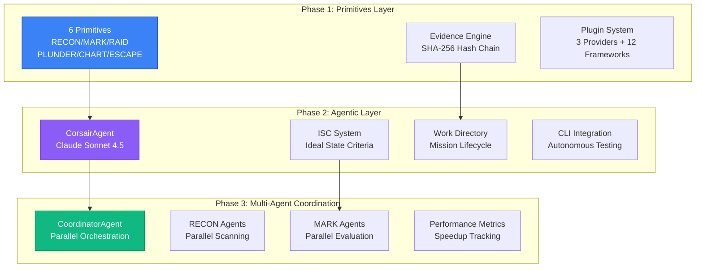
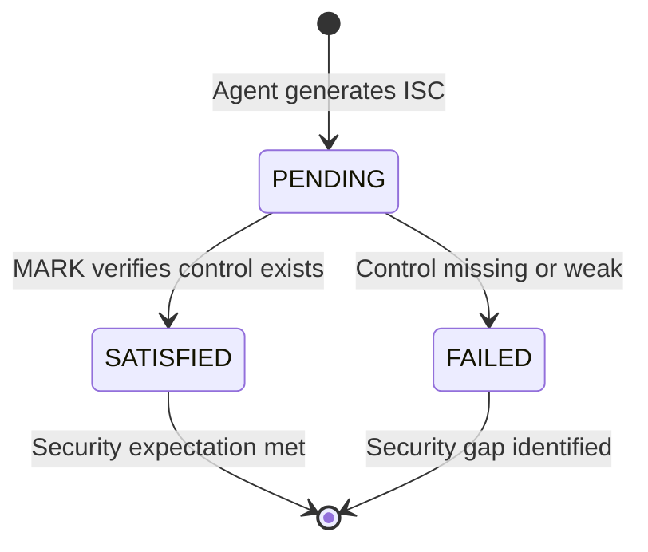
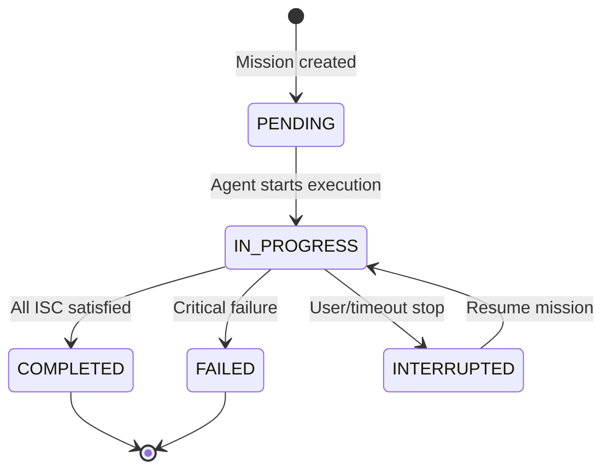
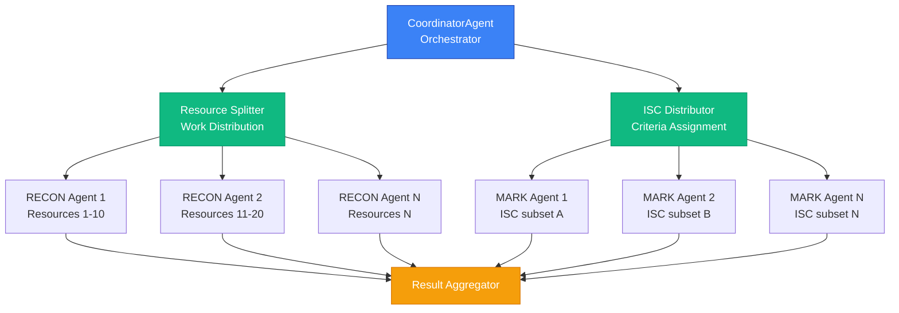

<div align="center">


</div>

# CORSAIR


**Chaos Operations for Resilience, Security Assurance & Incremental Reinforcement**

> Agentic Pirate raiding your GRC program.

**Tagline:** Attack first. Discover reality. Evidence emerges.

---

## What is CORSAIR?

CORSAIR is an **agentic chaos engineering platform** that validates compliance through adversarial testing. It discovers the *actual* state of your security controls by attacking them—not by reading documentation.

Unlike traditional GRC tools that check if you *documented* security controls, CORSAIR proves they *actually work under attack*.

**Current Providers:** AWS Cognito, AWS S3, Azure Entra ID (skeleton). Provider-agnostic engine accepts any JSON snapshot — add new providers via the plugin system.

Compliance evidence is generated as a **byproduct** of attacks, not as a goal.

---

## Architecture

CORSAIR uses a **three-phase architecture** that scales from atomic primitives to autonomous multi-agent execution.

### Three-Phase Architecture



**Phase 1:** Core chaos engineering primitives with plugin architecture
**Phase 2:** AI-powered autonomous testing with ISC criteria tracking
**Phase 3:** Multi-agent parallel execution for enterprise scale

---

## ISC System (Ideal State Criteria)

CORSAIR uses **ISC** (Ideal State Criteria) to define and track security expectations. This system bridges human intuition with automated verification.

### What is ISC?

ISC criteria are **security expectations** that meet these requirements:
- **8 words maximum**: Concise, actionable statements
- **Binary outcomes**: PENDING → SATISFIED or FAILED
- **Granular**: One security control per criterion
- **Testable**: Automated verification via API

### ISC Lifecycle



### Example ISC Criteria

```
✅ "Public access block enabled at bucket level"
✅ "Server-side encryption configured using AES-256 standard"
✅ "Multi-factor authentication enforced for all user accounts"
✅ "CloudTrail logging enabled with integrity validation"
```

### ISC Components

| Component | Location | Purpose |
|-----------|----------|---------|
| **ISCManager** | `src/core/isc-manager.ts` | Tracks ISC lifecycle and satisfaction |
| **ISCExtractor** | `src/core/isc-extractor.ts` | Extracts ISC from agent responses |
| **ISCIndex** | `src/core/isc-index.ts` | Searchable ISC database |
| **ISCDistributor** | `src/core/isc-distributor.ts` | Distributes ISC to parallel agents |

### How It Works

1. **Generation**: CorsairAgent generates ISC from service security knowledge
2. **Extraction**: ISCExtractor parses criteria from agent response
3. **Persistence**: ISC.json saved to `missions/{missionId}/ISC.json`
4. **Evaluation**: MARK primitive verifies each criterion against reality
5. **Tracking**: ISCManager updates satisfaction status (SATISFIED/FAILED)

---

## Work Directory System

CORSAIR maintains structured mission directories for complete audit trails.

### Directory Structure

```
missions/
  mission_YYYYMMDD_HHMMSS_random/
    mission-metadata.json  # Mission configuration
    mission.log            # Execution log
    ISC.json               # Generated criteria
    evidence/              # PLUNDER artifacts
```

### Mission Lifecycle



### Mission Phases

Each mission tracks progress through the 6-primitive lifecycle:

```
RECON → MARK → RAID → PLUNDER → CHART → ESCAPE
```

- **RECON**: Reconnaissance (read-only)
- **MARK**: Drift detection (ISC evaluation)
- **RAID**: Controlled chaos injection
- **PLUNDER**: Evidence extraction
- **CHART**: Framework mapping (12+ frameworks via CTID/SCF data)
- **ESCAPE**: Cleanup and rollback

---

## Multi-Agent Coordination (Phase 3)

CORSAIR scales via **parallel agent execution** for enterprise workloads.

### Coordination Architecture



### Agent Specializations

| Agent Type | Parallelism | Purpose | Coordination |
|------------|-------------|---------|--------------|
| **RECON** | ✅ Parallel | Resource discovery | Resource splitting |
| **MARK** | ✅ Parallel | ISC evaluation | ISC distribution |
| **RAID** | ❌ Single | Attack execution | Sequential only |

### Agent Lifecycle

```
SPAWNING → RUNNING → COMPLETED / FAILED / TIMEOUT
```

Each agent maintains:
- **Agent ID**: Unique identifier (e.g., `recon-agent-0`)
- **Work Directory**: `agents/{agentId}/`
- **Status File**: `agent-status.json`
- **Output**: `snapshot-partial.json` or `drift-findings.json`

### Performance Metrics

The coordinator tracks:
- **Speedup factor**: Parallel performance vs sequential
- **Resources per second**: Throughput measurement
- **Per-phase duration**: RECON, MARK, RAID timing
- **Agent health**: Success/failure rates

---

## CLI Usage

CORSAIR provides a command-line interface for autonomous security testing.

### Basic Usage

```bash
# Set credentials
export ANTHROPIC_API_KEY=your_key_here
export AWS_PROFILE=your_profile

# Run mission with automatic ISC generation
bun run corsair --target us-west-2_ABC123 --service cognito
```

### CLI Options

| Flag | Alias | Description | Default |
|------|-------|-------------|---------|
| `--target` | `-t` | Target resource ID (User Pool ID, bucket name) | Required |
| `--service` | `-s` | Service type (`cognito` \| `s3`) | Required |
| `--output` | `-o` | Custom evidence output path | `./evidence/corsair-{timestamp}.jsonl` |
| `--model` | `-m` | Model selection (`sonnet` \| `haiku` \| `auto`) | `sonnet` |
| `--max-turns` | | Maximum agent turns before timeout | `20` |
| `--quiet` | `-q` | Suppress verbose output | `false` |
| `--source` | | Data source (`aws` \| `fixture`) | `aws` |

### ISC Workflow Example

```bash
# Run autonomous mission
bun run corsair --target my-user-pool --service cognito \
  --output ./audits/q1-2026/cognito-audit.jsonl

# Agent will:
# 1. Generate ISC criteria from security knowledge
#    → "Multi-factor authentication enforced for all accounts"
#    → "Password policy requires 14 characters minimum"
#    → "Account lockout enabled after failed attempts"
#
# 2. Execute RECON → MARK → RAID lifecycle
#
# 3. Track ISC status: PENDING → SATISFIED/FAILED
#    ✅ SATISFIED: "MFA enforced" (SmsMfaConfiguration=ON)
#    ❌ FAILED: "Password requires 14 chars" (found 8)
#
# 4. Output cryptographic evidence chain
#    → ./audits/q1-2026/cognito-audit.jsonl
#    → missions/{missionId}/ISC.json
```

### CI/CD Integration

```bash
# Jenkins pipeline example
bun run corsair \
  --target prod-user-pool \
  --service cognito \
  --output /var/jenkins/evidence/cognito-${BUILD_ID}.jsonl \
  --quiet
```

---

## Quick Start

```bash
# Clone and enter
git clone https://github.com/Arudjreis/corsair.git
cd corsair

# Install dependencies
bun install

# Set credentials
export ANTHROPIC_API_KEY=your_key_here
export AWS_PROFILE=your_profile

# Run your first mission
bun run corsair --target us-west-2_ABC123 --service cognito

# Check generated mission
ls -la missions/mission_*
# → ISC.json (generated criteria)
# → mission-metadata.json (configuration)
# → mission.log (execution log)
```

---

## Plugin Architecture

CORSAIR follows a plugin-first architecture with auto-discovery. Engines are provider-agnostic — any snapshot shape works with MARK, RAID, and ESCAPE.

### Included Plugins

| Plugin | Provider | Attack Vectors | Status |
|--------|----------|---------------|--------|
| **aws-cognito** | AWS Cognito | mfa-bypass, password-spray, token-replay, session-hijack | Full |
| **aws-s3** | AWS S3 | public-access-test, encryption-test, versioning-test | Full |
| **azure-entra** | Azure Entra ID | conditional-access-bypass, password-sync-exploit, mfa-fatigue | Skeleton |

### Plugin Discovery

Plugins are auto-discovered when you call `corsair.initialize()`:

```typescript
const corsair = new Corsair();
await corsair.initialize();  // Scans plugins/ for *.plugin.json

console.log(corsair.getPlugins().map(p => p.manifest.providerId));
// Output: ["aws-cognito", "aws-s3", "azure-entra"]
```

### Plugin Manifest Schema

Each plugin provides a `*.plugin.json` manifest with attack vectors and framework mappings:

```json
{
  "providerId": "aws-s3",
  "providerName": "AWS S3",
  "version": "1.0.0",
  "attackVectors": [
    {
      "id": "public-access-test",
      "name": "Public Access Test",
      "description": "Tests S3 public access block configuration",
      "severity": "CRITICAL",
      "mitreMapping": ["T1530"]
    }
  ],
  "frameworkMappings": {
    "drift": {
      "publicAccessBlock": {
        "mitre": "T1530",
        "controls": {
          "NIST-800-53": [{ "controlId": "AC-3", "controlName": "Access Enforcement" }],
          "SOC2": [{ "controlId": "CC6.1", "controlName": "Logical Access Security" }],
          "PCI-DSS": [{ "controlId": "1.3.1", "controlName": "Restrict inbound traffic" }]
        }
      }
    }
  }
}
```

### Creating a New Provider Plugin

1. Create directory: `plugins/my-provider/`
2. Create manifest: `my-provider.plugin.json` with `attackVectors` and `frameworkMappings`
3. Create TypeScript module with snapshot type, type guard, and factory function
4. Test: `await corsair.initialize()` should discover your plugin

See `plugins/aws-cognito/` for full reference or `plugins/azure-entra/` for a minimal skeleton.

---

## Evidence Auto-Generation

Every attack automatically maps findings to compliance frameworks. You don't select a framework. You attack. The framework mappings happen in the background.

CORSAIR uses a **3-tier mapping resolution**:
1. **Plugin manifest** (highest priority) — plugin-specific control mappings
2. **CTID/SCF data** — 6,300+ ATT&CK-to-NIST mappings + SCF crosswalk to 175+ frameworks
3. **Legacy fallback** — hardcoded mappings as safety net

### Framework Coverage (12+ Frameworks)

| Framework | Source | Example Controls |
|-----------|--------|-----------------|
| MITRE ATT&CK | CTID | T1556.006, T1078, T1530 |
| NIST 800-53 | CTID | AC-3, IA-2, IA-5, SC-12 |
| NIST CSF | SCF | PR.AC-7, PR.DS-2, DE.CM-3 |
| SOC 2 | SCF + Plugin | CC6.1, CC6.2, CC6.3, CC6.6 |
| ISO 27001 | SCF + Plugin | A.9.2.3, A.9.4.2, A.12.4.1 |
| CIS Controls | SCF + Plugin | 6.2, 6.3, 6.5, 8.2 |
| PCI-DSS | SCF + Plugin | 1.3.1, 3.4, 8.3.1 |
| HIPAA | SCF | 164.312(a)(1), 164.312(d) |
| GDPR | SCF | Art. 32(1)(a), Art. 32(1)(b) |
| CMMC | SCF | AC.L2-3.1.1, IA.L2-3.5.3 |
| FedRAMP | SCF | AC-3, IA-2 (inherits NIST) |
| SOX | SCF | IT-GC 4.1, IT-GC 4.2 |
| COBIT | SCF | DSS05.04, DSS05.05 |

> Data sources: [CTID ATT&CK Mappings](https://github.com/center-for-threat-informed-defense/attack-control-framework-mappings), [Secure Controls Framework](https://securecontrolsframework.com/)

---

## MCP Server

CORSAIR exposes all primitives via the [Model Context Protocol](https://modelcontextprotocol.io/) for integration with Claude Code and other AI agents.

### Setup

```bash
# Start the MCP server
bun run mcp-server.ts
```

Add to your Claude Code configuration:

```json
{
  "mcpServers": {
    "corsair": {
      "command": "bun",
      "args": ["run", "/path/to/corsair/mcp-server.ts"]
    }
  }
}
```

### Available Tools

| Tool | Description |
|------|-------------|
| `corsair_recon` | Read-only reconnaissance on target systems |
| `corsair_mark` | Detect configuration drift against baselines |
| `corsair_raid` | Execute controlled chaos attacks |
| `corsair_plunder` | Extract cryptographic evidence chains |
| `corsair_chart` | Map findings to 12+ compliance frameworks |
| `corsair_escape` | Rollback changes and restore state |
| `corsair_strike` | Full cycle convenience (RECON → ESCAPE) |
| `corsair_report` | Generate OSCAL/HTML/Markdown reports |

### MCP Resources

| Resource | Description |
|----------|-------------|
| `corsair://evidence/latest` | Most recent evidence chain |
| `corsair://frameworks/supported` | List of supported frameworks |

---

## OSCAL Output & Reports

CORSAIR generates machine-readable [OSCAL](https://pages.nist.gov/OSCAL/) Assessment Results and human-readable reports.

### Output Formats

```bash
# Generate OSCAL JSON (machine-readable, NIST SP 800-53A compliant)
bun run corsair --target my-pool --service cognito --format oscal

# Generate HTML report (self-contained, no external dependencies)
bun run corsair --target my-pool --service cognito --format html

# Generate Markdown report
bun run corsair --target my-pool --service cognito --format md
```

### OSCAL Mapping

| Corsair Concept | OSCAL Element |
|----------------|---------------|
| ISC Criteria | Findings (satisfied/not-satisfied) |
| MARK Drift Findings | Observations (TEST method) |
| RAID Results | Risks (open/closed) |
| CHART Frameworks | Reviewed Controls (control-selections) |

### Report Sections

HTML and Markdown reports include:
- **Executive Summary**: Mission overview, ISC satisfaction rate, risk score
- **Framework Coverage**: Which frameworks mapped, control counts
- **Finding Details**: Per-finding severity, drift values, remediation context
- **Evidence Chain**: Hash chain verification, record count, integrity status
- **ISC Table**: Full criteria list with SATISFIED/FAILED status

---

## Philosophy

**Old approach**: Configure framework → Define controls → Test against checklist → Generate evidence

**CORSAIR approach**: Launch attack → Discover reality → Evidence emerges

The difference is existential. Compliance tools ask "are you compliant?" CORSAIR asks "what actually happens when things go wrong?"

---

## Technical Details

- **Runtime**: Bun (TypeScript, no build step)
- **AI Models**: Claude Sonnet 4.5 (complex reasoning), Haiku 4.5 (fast operations)
- **Architecture**: 3-phase (Primitives → Agentic → Multi-Agent)
- **ISC System**: Automatic criteria extraction and tracking
- **Evidence**: JSONL with SHA-256 hash chain integrity
- **Plugin System**: Provider-agnostic core with 3 plugins (Cognito, S3, Azure Entra)
- **Framework Mapping**: 12+ frameworks via CTID/SCF data (3-tier resolution)
- **MCP Server**: 8 tools + 2 resources for AI agent integration
- **Output**: OSCAL JSON, HTML reports, Markdown reports
- **Event System**: Pub/sub events with aggregation and query support
- **Tests**: 561 tests across 41 files (primitives, patterns, ISC, coordination, MCP, output, E2E)

---

## Project Structure

```
src/
  corsair-mvp.ts         # Backwards-compat shim (re-exports from engine/)
  types.ts               # Type definitions (extensible Framework/AttackVector unions)
  evidence.ts            # JSONL evidence engine with hash chain
  compaction.ts          # Evidence compaction (OpenClaw Pattern 1)

  engine/                # Core engine modules (provider-agnostic)
    index.ts             # Corsair facade class + barrel re-exports
    recon-engine.ts      # RECON: Read-only observation (fixture/aws/file modes)
    mark-engine.ts       # MARK: Drift detection (any snapshot shape)
    raid-engine.ts       # RAID: Attack simulation (Cognito + S3 vectors)
    chart-engine.ts      # CHART: 3-tier framework mapping (12+ frameworks)
    escape-engine.ts     # ESCAPE: Scope guards, rollback, RAII cleanup
    event-engine.ts      # Event querying and aggregation
    plugin-engine.ts     # Plugin discovery and registry

  data/                  # Framework mapping data layer
    mapping-loader.ts    # CTID/SCF loader with singleton cache
    ctid-mappings.json   # ATT&CK → NIST 800-53 (6,300+ mappings)
    scf-crosswalk.json   # NIST 800-53 → 175+ frameworks

  mcp/                   # Model Context Protocol server
    server.ts            # 8 tools + 2 resources

  output/                # Report generation
    oscal-types.ts       # OSCAL Assessment Results type definitions
    oscal-generator.ts   # OSCAL JSON generator
    report-generator.ts  # HTML + Markdown report generator

  core/
    isc-manager.ts       # ISC lifecycle tracking
    isc-extractor.ts     # Extract ISC from agent responses
    isc-index.ts         # Searchable ISC database
    isc-distributor.ts   # Parallel ISC distribution to MARK agents
    work-manager.ts      # Mission directory management
    learning-manager.ts  # Cross-mission pattern learning
    resource-splitter.ts # Parallel RECON distribution
    mission-resumer.ts   # Resume interrupted missions

  agents/
    corsair-agent.ts     # Main CorsairAgent (Claude Sonnet 4.5)
    coordinator-agent.ts # Multi-agent coordinator
    tool-definitions.ts  # Agent tool schemas (13 frameworks, 7 vectors)
    system-prompts.ts    # Agent system prompts
    agent-validator.ts   # Agent output validation

  types/
    isc.ts               # ISC type definitions
    work.ts              # Work directory types
    learning.ts          # Learning system types
    coordination.ts      # Multi-agent coordination types

plugins/
  aws-cognito/           # Full plugin (4 attack vectors)
    aws-cognito.plugin.json
    aws-cognito-plugin.ts
    index.ts
  aws-s3/                # Full plugin (3 attack vectors)
    aws-s3.plugin.json
    aws-s3-plugin.ts
  azure-entra/           # Skeleton plugin (3 attack vectors, fixture-only)
    azure-entra.plugin.json
    azure-entra-plugin.ts

mcp-server.ts            # MCP server entry point (#!/usr/bin/env bun)

tests/
  primitives/            # 6 primitive tests (RECON, MARK, RAID, PLUNDER, CHART, ESCAPE)
  patterns/              # OpenClaw pattern tests (events, compaction, hash chain)
  plugin-system/         # Plugin discovery, S3, Azure Entra tests
  data/                  # MappingLoader + framework coverage tests
  mcp/                   # MCP server tool + resource tests
  output/                # OSCAL generator + report generator tests
  isc/                   # ISC extraction, persistence, integration tests
  work/                  # Work directory and mission lifecycle tests
  coordination/          # Multi-agent coordination tests
  integration/           # E2E multi-framework pipeline tests
  learning/              # Learning system tests
  cli/                   # CLI tests
```

---

## Testing

561 tests across 41 files:

```bash
# All tests
bun test

# By category
bun test tests/primitives/       # Core primitive tests
bun test tests/plugin-system/    # Plugin + provider tests
bun test tests/data/             # Framework mapping tests
bun test tests/mcp/              # MCP server tests
bun test tests/output/           # OSCAL + report tests
bun test tests/isc/              # ISC system tests
bun test tests/coordination/     # Multi-agent tests
bun test tests/integration/      # E2E multi-framework pipeline
```

---

## Security Policy

See [SECURITY.md](SECURITY.md) for vulnerability reporting.

---

## Contributing

See [CONTRIBUTING.md](CONTRIBUTING.md) for contribution guidelines.

---

## License

MIT

---

🏴‍☠️ **Autonomous. Adversarial. Agentic.**
