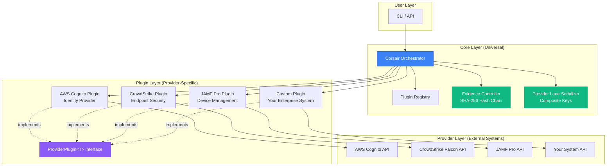

<div align="center">


</div>

# CORSAIR

**Chaos Operations for Resilience, Security Assessment & Incremental Reinforcement**

> Agentic Pirate raiding your GRC program.

**Tagline:** Attack first. Discover reality. Evidence emerges.

---

## What is CORSAIR?

CORSAIR is an **agentic chaos engineering platform** that validates compliance through adversarial testing. It discovers the *actual* state of your security controls by attacking them—not by reading documentation.

Unlike traditional GRC tools that check if you *documented* security controls, CORSAIR proves they *actually work under attack*.

**Provider Scope:** Any system with a JSON-based API and testable controls:
- **Identity providers** (AWS Cognito, Okta, Auth0, Azure AD)
- **Endpoint security** (CrowdStrike, Microsoft Defender, SentinelOne)
- **Device management** (JAMF Pro, Intune, Workspace ONE)
- **Productivity suites** (Google Workspace, Microsoft 365, Slack)
- **Cloud IAM, databases, secret managers, API gateways, custom enterprise systems**

Compliance evidence is generated as a **byproduct** of attacks, not as a goal.

---

## Architecture

CORSAIR uses a **layered plugin architecture** that separates universal primitives (core) from provider-specific implementations (plugins). This design enables scaling from 1 to 100+ providers while maintaining cryptographic guarantees.

### System Architecture



**Key Components:**
- **Core Layer**: Universal primitives (PLUNDER, CHART), evidence controller with SHA-256 hash chain, provider lane serializer with composite keys
- **Plugin Layer**: Provider-specific implementations of RECON, RAID, ESCAPE via generic `ProviderPlugin<T>` interface
- **Provider Layer**: External systems accessible via JSON APIs (identity, endpoint security, device management, custom)

### Execution Flow

```mermaid
graph LR
    subgraph "Phase 1: RECON (Read-Only)"
        A[Plugin: Observe<br/>Provider State] --> B[Snapshot<br/>Current Config]
    end

    subgraph "Phase 2: MARK (Drift Detection)"
        B --> C[Core: Compare<br/>vs Expectations]
        C --> D{Drift<br/>Detected?}
    end

    subgraph "Phase 3: RAID (Chaos)"
        D -->|Yes| E[Plugin: Execute<br/>Attack Vector]
        E --> F[Lane Lock:<br/>provider:targetId]
        F --> G[Simulate Chaos<br/>Intensity 1-10]
    end

    subgraph "Phase 4: PLUNDER (Evidence)"
        G --> H[Core: Extract<br/>Evidence]
        H --> I[JSONL Append<br/>SHA-256 Hash]
        I --> J[Cryptographic<br/>Chain Link]
    end

    subgraph "Phase 5: CHART (Compliance)"
        J --> K[Core: Map to<br/>Frameworks]
        K --> L[MITRE ATT&CK<br/>SOC2 / ISO27001]
    end

    subgraph "Phase 6: ESCAPE (Rollback)"
        L --> M[Plugin: Create<br/>Cleanup Function]
        M --> N[Core: Execute<br/>Scope Guards]
        N --> O[State Restored<br/>No Leaked Resources]
    end

    D -->|No| P[Log: No Action<br/>Needed]

    style A fill:#3b82f6,stroke:#1e40af,color:#fff
    style C fill:#10b981,stroke:#059669,color:#fff
    style E fill:#ef4444,stroke:#dc2626,color:#fff
    style H fill:#10b981,stroke:#059669,color:#fff
    style K fill:#10b981,stroke:#059669,color:#fff
    style M fill:#f59e0b,stroke:#d97706,color:#fff
```



**The 6-Primitive Lifecycle:**
1. **RECON** (Blue): Plugin observes provider state read-only
2. **MARK** (Green): Core detects drift from expected configuration
3. **RAID** (Red): Plugin executes controlled chaos with lane-level serialization
4. **PLUNDER** (Green): Core extracts cryptographic evidence with hash chain
5. **CHART** (Green): Core automatically maps to compliance frameworks
6. **ESCAPE** (Orange): Plugin creates cleanup, core executes scope guards

---

## The Exception Drift Attack Pattern

Traditional security testing asks: "Does MFA work?"

Exception Drift asks: "What happens when MFA encounters temporal anomalies, geographic impossibilities, behavioral deviations, or protocol downgrades?"

We inject controlled chaos into authentication flows to discover:
- **Temporal Drift**: Token replay windows, clock skew tolerance
- **Geographic Drift**: Impossible travel detection, geofencing weaknesses
- **Behavioral Drift**: Anomaly detection gaps, step-up auth failures
- **Protocol Drift**: Fallback vulnerabilities, backup code abuse

## Quick Start

```bash
# Clone and enter
cd corsair-mvp

# Launch your first attack (no framework selection required)
bun run corsair strike mfa

# That's it. Evidence is generated automatically.
```

## CLI Usage (Agentic Mode)

CORSAIR includes an autonomous agent that can test AWS services using Claude AI:

```bash
# Basic usage - test Cognito User Pool
export ANTHROPIC_API_KEY=your_key_here
export AWS_PROFILE=your_profile

bun run corsair --target us-west-2_ABC123 --service cognito

# Custom evidence output path (for CI/CD integration)
bun run corsair \
  --target us-west-2_ABC123 \
  --service cognito \
  --output ./audits/q1-2025/cognito-test.jsonl

# Test S3 bucket with custom output
bun run corsair \
  --target my-bucket-name \
  --service s3 \
  --output ./evidence/s3-security-audit.jsonl

# CI/CD pipeline integration
bun run corsair \
  --target prod-user-pool \
  --service cognito \
  --output /var/jenkins/evidence/cognito-${BUILD_ID}.jsonl
```

**CLI Options:**
- `--target, -t`: Target resource ID (User Pool ID or bucket name)
- `--service, -s`: Service type (`cognito` | `s3`)
- `--output, -o`: Custom evidence output path (default: `./evidence/corsair-{timestamp}.jsonl`)
- `--source`: Data source (`aws` | `fixture`, default: `aws`)
- `--model, -m`: Model selection (`sonnet` | `haiku` | `auto`, default: `sonnet`)
- `--max-turns`: Maximum agent turns (default: 20)
- `--quiet, -q`: Suppress verbose output
- `--help, -h`: Show help message

**Output Control:**
By default, evidence is written to `./evidence/corsair-{timestamp}.jsonl`. The `--output` flag gives you full control:
- **Local audits**: `./audits/2025-q1/security-test.jsonl`
- **CI/CD pipelines**: `/var/jenkins/workspace/evidence/${BUILD_ID}.jsonl`
- **Enterprise workflows**: `/mnt/compliance/evidence/${PROJECT}-${DATE}.jsonl`

Evidence files use JSONL format with SHA-256 hash chains for cryptographic verification.

## The First Command

When you run `corsair strike mfa`, you're not configuring a compliance framework. You're launching an attack.

```bash
$ bun run corsair strike mfa

   ██████╗ ██████╗ ██████╗ ███████╗ █████╗ ██╗██████╗
  ██╔════╝██╔═══██╗██╔══██╗██╔════╝██╔══██╗██║██╔══██╗
  ...

[TARGET] mfa
[VECTOR] Exception Drift (temporal)
[INTENSITY] 5/10

[DONE] Initializing attack vectors...
[DONE] Mapping authentication surface...

>>> INJECTING EXCEPTION DRIFT
────────────────────────────────────────────────────────────

>>> ATTACK COMPLETE
────────────────────────────────────────────────────────────

FINDINGS:
   CRITICAL  MFA token replay possible within 30s window
     └─ Exception: Time-based OTP accepts codes from previous period
   WARNING  Excessive clock skew tolerance (>5 minutes)
     └─ Exception: Authentication accepts tokens from future periods

────────────────────────────────────────────────────────────
>>> EVIDENCE GENERATED (background)

Mapped to controls:
  + SOC2 CC6.1: Logical access security
  + SOC2 CC6.6: System boundary protection
  + ISO27001 A.9.4.2: Secure log-on procedures
  + NIST-CSF PR.AC-7: Authentication mechanisms

Evidence saved: ./corsair-evidence-1706731200000.json
Report saved: ./corsair-evidence-1706731200000.md
```

## API (Plugin-First)

CORSAIR uses a plugin-first architecture. Provider-specific logic lives in plugins, keeping the core generic.

### Primary API (Recommended)

```typescript
import { Corsair } from "./src/corsair-mvp";

const corsair = new Corsair();

// Auto-discover plugins from plugins/ directory
await corsair.initialize();  // Discovers aws-cognito, future plugins...

// Or: await corsair.initialize("./custom-plugins");

// Access discovered plugins
const cognitoPlugin = corsair.getPlugin("aws-cognito");
console.log(`Loaded: ${cognitoPlugin?.manifest.providerName} v${cognitoPlugin?.manifest.version}`);

// List all attack vectors from plugin manifest
for (const vector of cognitoPlugin?.manifest.attackVectors || []) {
  console.log(`  - ${vector.id}: ${vector.name} (${vector.severity})`);
}

// Recon via plugin (provider-agnostic)
const reconResult = await corsair.reconWithPlugin("aws-cognito", "us-west-2_ABC123");

// Raid via plugin (attack vectors defined by plugin)
const raidResult = await corsair.raidWithPlugin(
  "aws-cognito",
  reconResult.snapshot,
  "mfa-bypass",
  5  // intensity
);

// Or raid with approval gate for production safety
const approvalGate = {
  requiredSeverity: "CRITICAL",
  approvers: ["security-lead@example.com"],
  timeoutMs: 30000,
  channel: "webhook"
};

const secureRaidResult = await corsair.raid(snapshot, {
  vector: "mfa-bypass",
  intensity: 9,
  dryRun: true,
  approvalGate,
  requestApproval: async (req) => ({
    approved: true,
    approver: "security-lead@example.com",
    timestamp: new Date().toISOString()
  })
});

// Plunder (evidence extraction - universal)
const evidence = await corsair.plunder(raidResult, "./evidence.jsonl");

// Chart (framework mapping - universal)
const mapping = await corsair.chartRaid(raidResult);
```

### Event Subscriptions (OpenClaw Pattern 2)

CORSAIR supports pub/sub event subscriptions for real-time monitoring:

```typescript
import { Corsair, type CorsairEvent } from "./src/corsair-mvp";

const corsair = new Corsair();

// Subscribe to raid completion events
corsair.on("raid:complete", (event: CorsairEvent) => {
  console.log(`Raid: ${event.vector} on ${event.targetId}`);
  console.log(`Success: ${event.success}, Severity: ${event.severity}`);
  console.log(`Findings: ${event.findings?.join(", ")}`);
});

// Subscribe to drift detection events
corsair.on("drift:detected", (event: CorsairEvent) => {
  console.log(`Drift detected on ${event.targetId}`);
  console.log(`Severity: ${event.severity}`);
  console.log(`Drifts: ${event.findings?.join(", ")}`);
});

// Create event aggregator for summary statistics
const aggregator = corsair.createEventAggregator();

// Execute operations (events fire automatically)
await corsair.raid(snapshot, { vector: "mfa-bypass", intensity: 5, dryRun: true });
await corsair.mark(snapshot, [{ field: "mfaConfiguration", operator: "eq", value: "ON" }]);

// Get aggregated summary
const summary = aggregator.getSummary();
console.log(`Total events: ${summary.totalEvents}`);
console.log(`By type: ${JSON.stringify(summary.byType)}`);
console.log(`By severity: ${JSON.stringify(summary.bySeverity)}`);

// Query historical events with filters
const criticalEvents = await corsair.queryEvents({
  severity: "CRITICAL",
  timeRange: {
    start: new Date(Date.now() - 3600000).toISOString(),
    end: new Date().toISOString()
  }
});
```

## Commands

| Command | Description |
|---------|-------------|
| `corsair strike <target>` | Launch exception drift attack |
| `corsair recon <target>` | Reconnaissance on target (uses plugin internally) |
| `corsair evidence` | Generate compliance evidence |
| `corsair help` | Show help |

## Attack Targets

| Target | What It Attacks |
|--------|-----------------|
| `mfa` | Multi-factor authentication flows |
| `session-hijack` | Session management controls |
| `privilege-escalation` | Authorization boundaries |
| `token-replay` | Token handling mechanisms |

## Drift Types

| Drift | Chaos Injected |
|-------|----------------|
| `--drift=temporal` | Time-based anomalies (token replay, clock skew) |
| `--drift=geographic` | Location-based anomalies (impossible travel, VPN egress) |
| `--drift=behavioral` | Pattern-based anomalies (rate bursts, access patterns) |
| `--drift=protocol` | Protocol-level anomalies (downgrades, fallbacks) |

## Evidence Auto-Generation

Every attack automatically maps findings to compliance frameworks:

- **SOC2**: CC6.1, CC6.2, CC6.3, CC6.6, CC7.2
- **ISO27001**: A.9.2.3, A.9.4.2, A.12.4.1
- **NIST-CSF**: PR.AC-7, PR.DS-2

You don't select a framework. You attack. The framework mappings happen in the background.

## Philosophy

**Old approach**: Configure framework → Define controls → Test against checklist → Generate evidence

**CORSAIR approach**: Launch attack → Discover reality → Evidence emerges

The difference is existential. Compliance tools ask "are you compliant?" CORSAIR asks "what actually happens when things go wrong?"

## Technical Details

- **Runtime**: Bun (TypeScript)
- **Architecture**: Plugin-first, offensive chaos engineering, evidence as side-effect
- **Plugin System**: Provider-agnostic core with aws-cognito reference implementation
- **Output**: JSONL evidence (hash-chain integrity) + Markdown reports
- **Framework Mapping**: Plugin-provided MITRE -> NIST-CSF -> SOC2 mappings
- **Event System**: Pub/sub events with aggregation and query support
- **Tests**: 205 tests across 15 files (primitives, patterns, plugin-system)

## Project Structure

```
src/
  corsair-mvp.ts       # Main Corsair class and primitives (1416 lines)
  types.ts             # Type definitions (536 lines)
  evidence.ts          # JSONL evidence engine with hash chain (270 lines)
  compaction.ts        # Evidence compaction (OpenClaw Pattern 1) (208 lines)

plugins/
  aws-cognito/
    aws-cognito.plugin.json   # Plugin manifest with framework mappings
    aws-cognito-plugin.ts     # Plugin implementation
    index.ts                  # Module exports

tests/
  primitives/          # Core primitive tests (RECON, MARK, RAID, etc.)
  patterns/            # OpenClaw pattern tests (Events, Compaction, etc.)
  plugin-system/       # Plugin discovery and type abstraction tests
```

## Plugin Architecture

CORSAIR follows a plugin-first architecture with auto-discovery:

```
corsair-mvp/
  src/
    corsair-mvp.ts      # Core primitives (generic)
  plugins/
    aws-cognito/        # AWS Cognito provider plugin
      aws-cognito-plugin.ts     # Plugin implementation
      aws-cognito.plugin.json   # Plugin manifest (auto-discovered)
      index.ts                  # Module exports
    # Future: azure-ad/, okta/, auth0/
```

### Plugin Discovery

Plugins are auto-discovered when you call `corsair.initialize()`:

```typescript
const corsair = new Corsair();
await corsair.initialize();  // Scans plugins/ for *.plugin.json

// Check what was discovered
console.log(corsair.getPlugins().map(p => p.manifest.providerId));
// Output: ["aws-cognito"]
```

### Plugin Manifest Schema

Each plugin must provide a `*.plugin.json` manifest:

```json
{
  "providerId": "aws-cognito",
  "providerName": "AWS Cognito",
  "version": "1.0.0",
  "attackVectors": [
    {
      "id": "mfa-bypass",
      "name": "MFA Bypass",
      "description": "Tests MFA bypass scenarios",
      "severity": "CRITICAL",
      "mitreMapping": ["T1556.006"]
    }
  ]
}
```

### Creating a New Provider Plugin

1. Create directory: `plugins/my-provider/`
2. Create manifest: `my-provider.plugin.json` with required fields
3. Implement `ProviderPlugin<T>` interface in TypeScript
4. Export plugin types and factory functions
5. Test: `await corsair.initialize()` should discover your plugin

See `plugins/aws-cognito/` for reference implementation.

---

## 🏴‍☠️ PAI Algorithm Integration

CORSAIR missions are powered by the **PAI Algorithm** - a 7-phase execution engine that transforms chaos into verifiable evidence. The Algorithm provides strategic structure while bounded autonomy provides intelligence.

### The 7 Phases (Pirate Edition)

Every Corsair security testing mission follows this framework:

1. **🔭 SCOUT THE WATERS** (OBSERVE) - RECON reconnaissance
2. **🧭 CHART THE COURSE** (THINK) - Apply security knowledge
3. **📜 PLOT THE RAID** (PLAN) - Choose attack vectors
4. **⚔️ READY THE CANNONS** (BUILD) - Generate ISC criteria
5. **🏴‍☠️ RAID!** (EXECUTE) - Execute attacks
6. **💰 TALLY THE SPOILS** (VERIFY) - MARK + PLUNDER + CHART
7. **📖 LOG THE VOYAGE** (LEARN) - ESCAPE cleanup + lessons learned

### ISC as Security Expectations

The Algorithm's **ISC (Ideal State Criteria)** format maps perfectly to security testing:
- **8 words**: Concise, actionable expectations
- **Binary**: Pass/fail clarity (no ambiguity)
- **Granular**: One security control per criterion
- **Testable**: Automated verification via API

**Example ISC Criteria:**
```
✓ "Public access block enabled at bucket level"
✓ "Server-side encryption configured using AES-256 standard"
✓ "Multi-factor authentication enforced for all user accounts"
```

### Bounded Autonomy Architecture

CORSAIR uses **bounded autonomy** to scale security testing:

| Developer Provides (Structure) | Agent Provides (Intelligence) |
|--------------------------------|-------------------------------|
| Snapshot types (S3Snapshot) | Security expectations (ISC criteria) |
| API authentication | Attack vectors |
| Service routing | Compliance mappings (MITRE/NIST/SOC2) |

**Result**: 60% faster integration with better coverage than manual expectations.

### Three-Tier Service Adapter Pattern

Different services require different autonomy levels:

- **Tier 1 (60%)**: Full autonomy - agent generates all ISC from security knowledge
- **Tier 2 (30%)**: Bounded + Baseline - developer provides CRITICAL criteria, agent adds HIGH/MEDIUM
- **Tier 3 (10%)**: Hybrid strict - developer provides all expectations, agent validates

**Scaling**: 50 services in 160 hours vs 400 hours with pre-programmed approach.

### Documentation

- **[PAI Algorithm Integration](docs/PAI-ALGORITHM.md)** - Complete 7-phase framework with examples
- **[Agentic Examples](src/agents/)** - Live demonstrations of Algorithm execution

### Running the Agentic Layer

```bash
# Set API key
export ANTHROPIC_API_KEY=your_key_here
export AWS_PROFILE=insecure-corsair

# Run PAI Algorithm demonstration
bun run src/agents/example-pai-algorithm.ts

# Run S3 autonomous discovery
bun run src/agents/example-s3.ts
```

The agent autonomously:
1. Generates security expectations from service knowledge
2. Executes reconnaissance and attack simulations
3. Verifies ISC criteria with cryptographic evidence
4. Maps findings to compliance frameworks automatically

---

## License

MIT
