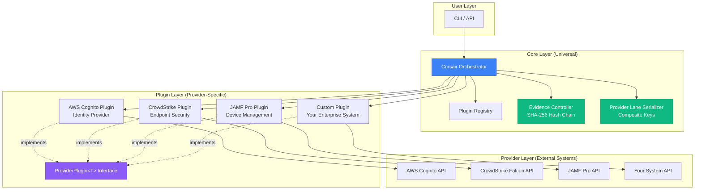

<div align="center">


</div>

# CORSAIR

**Chaos Operations for Resilience, Security Assessment & Incremental Reinforcement**

> Agentic Pirate raiding your GRC program.

**Tagline:** Attack first. Discover reality. Evidence emerges.

---

## What is CORSAIR?

CORSAIR is an **agentic chaos engineering platform** that validates compliance through adversarial testing. It discovers the *actual* state of your security controls by attacking them—not by reading documentation.

Unlike traditional GRC tools that check if you *documented* security controls, CORSAIR proves they *actually work under attack*.

**Provider Scope:** Any system with a JSON-based API and testable controls:
- **Identity providers** (AWS Cognito, Okta, Auth0, Azure AD)
- **Endpoint security** (CrowdStrike, Microsoft Defender, SentinelOne)
- **Device management** (JAMF Pro, Intune, Workspace ONE)
- **Productivity suites** (Google Workspace, Microsoft 365, Slack)
- **Cloud IAM, databases, secret managers, API gateways, custom enterprise systems**

Compliance evidence is generated as a **byproduct** of attacks, not as a goal.

---

## Architecture

CORSAIR uses a **layered plugin architecture** that separates universal primitives (core) from provider-specific implementations (plugins). This design enables scaling from 1 to 100+ providers while maintaining cryptographic guarantees.

### System Architecture



**Key Components:**
- **Core Layer**: Universal primitives (PLUNDER, CHART), evidence controller with SHA-256 hash chain, provider lane serializer with composite keys
- **Plugin Layer**: Provider-specific implementations of RECON, RAID, ESCAPE via generic `ProviderPlugin<T>` interface
- **Provider Layer**: External systems accessible via JSON APIs (identity, endpoint security, device management, custom)

### Execution Flow

```mermaid
graph LR
    subgraph "Phase 1: RECON (Read-Only)"
        A[Plugin: Observe<br/>Provider State] --> B[Snapshot<br/>Current Config]
    end

    subgraph "Phase 2: MARK (Drift Detection)"
        B --> C[Core: Compare<br/>vs Expectations]
        C --> D{Drift<br/>Detected?}
    end

    subgraph "Phase 3: RAID (Chaos)"
        D -->|Yes| E[Plugin: Execute<br/>Attack Vector]
        E --> F[Lane Lock:<br/>provider:targetId]
        F --> G[Simulate Chaos<br/>Intensity 1-10]
    end

    subgraph "Phase 4: PLUNDER (Evidence)"
        G --> H[Core: Extract<br/>Evidence]
        H --> I[JSONL Append<br/>SHA-256 Hash]
        I --> J[Cryptographic<br/>Chain Link]
    end

    subgraph "Phase 5: CHART (Compliance)"
        J --> K[Core: Map to<br/>Frameworks]
        K --> L[MITRE ATT&CK<br/>SOC2 / ISO27001]
    end

    subgraph "Phase 6: ESCAPE (Rollback)"
        L --> M[Plugin: Create<br/>Cleanup Function]
        M --> N[Core: Execute<br/>Scope Guards]
        N --> O[State Restored<br/>No Leaked Resources]
    end

    D -->|No| P[Log: No Action<br/>Needed]

    style A fill:#3b82f6,stroke:#1e40af,color:#fff
    style C fill:#10b981,stroke:#059669,color:#fff
    style E fill:#ef4444,stroke:#dc2626,color:#fff
    style H fill:#10b981,stroke:#059669,color:#fff
    style K fill:#10b981,stroke:#059669,color:#fff
    style M fill:#f59e0b,stroke:#d97706,color:#fff
```



**The 6-Primitive Lifecycle:**
1. **RECON** (Blue): Plugin observes provider state read-only
2. **MARK** (Green): Core detects drift from expected configuration
3. **RAID** (Red): Plugin executes controlled chaos with lane-level serialization
4. **PLUNDER** (Green): Core extracts cryptographic evidence with hash chain
5. **CHART** (Green): Core automatically maps to compliance frameworks
6. **ESCAPE** (Orange): Plugin creates cleanup, core executes scope guards

### Plugin System

```typescript
// Initialize with plugin discovery
const corsair = new Corsair();
await corsair.initialize("plugins/");

// Execute plugin-based RECON
const { snapshot } = await corsair.reconWithPlugin("aws-cognito", "us-east-1_ABC123");

// Execute plugin-based RAID
const result = await corsair.raidWithPlugin("aws-cognito", snapshot, "mfa-bypass", 5);

// Create plugin-based cleanup
const cleanup = corsair.createPluginCleanup("aws-cognito", snapshot);
const escapeResult = corsair.escape([cleanup]);
```

**Current Status:**
- ✅ Plugin architecture implemented
- ✅ AWS Cognito plugin (first proof-of-concept)
- ✅ 108 tests passing (45 primitives + 63 plugin system)
- ⬜ Additional providers (Okta, CrowdStrike, JAMF, etc.) - coming soon

See [`PLUGIN_ARCHITECTURE.md`](PLUGIN_ARCHITECTURE.md) for complete documentation.

---

## The 6 Primitives

Every Corsair operation is built from these atomic primitives:

| Primitive | Purpose | Example |
|-----------|---------|---------|
| **RECON** | Observe provider state (read-only) | Snapshot AWS Cognito MFA configuration |
| **MARK** | Identify drift from expectations | Compare observed vs expected MFA settings |
| **RAID** | Execute controlled chaos attacks | Simulate MFA bypass when MFA=OFF |
| **PLUNDER** | Extract cryptographic evidence | JSONL with SHA-256 hash chain |
| **CHART** | Map to compliance frameworks | Automatic MITRE ATT&CK + SOC2/ISO27001 |
| **ESCAPE** | Rollback with scope guards | Restore original state, no leaked resources |

**Design Principle:** Plugins implement 4 primitives (RECON, RAID, ESCAPE, provider-specific MARK). PLUNDER and CHART are 100% universal—no plugin code needed.

---

## Attack Vectors with MITRE Mapping

Each plugin declares attack vectors with MITRE ATT&CK mappings:

### AWS Cognito Plugin (Current)

| Vector | MITRE Technique | Description |
|--------|-----------------|-------------|
| `mfa-bypass` | T1556.006 | Multi-Factor Authentication Interception |
| `password-spray` | T1110.003 | Password Spraying |
| `token-replay` | T1550.001 | Application Access Token |
| `session-hijack` | T1563 | Remote Service Session Hijacking |

### Coming Soon

| Provider | Example Vectors | MITRE Techniques |
|----------|-----------------|------------------|
| **CrowdStrike** | Quarantine policy bypass | T1562.001 (Impair Defenses) |
| **JAMF Pro** | Compliance drift (encryption disabled) | T1601 (Modify System Image) |
| **Google Workspace** | External sharing override | T1567.002 (Data Exfiltration) |
| **AWS IAM** | Overly permissive role assumption | T1078.004 (Cloud Accounts) |

---

## Evidence Auto-Generation

Every raid automatically generates cryptographic evidence:

**Format:** JSONL with SHA-256 hash chain linking all records

**Framework Mappings:**
- **MITRE ATT&CK**: Attack vector techniques (T1556.006, etc.)
- **SOC2**: CC6.1, CC6.2, CC6.3, CC6.6, CC7.2
- **ISO27001**: A.9.2.3, A.9.4.2, A.12.4.1
- **NIST-CSF**: PR.AC-7, PR.DS-2

**Key Features:**
- Append-only JSONL (immutable audit trail)
- Cryptographic hash chain (tamper-evident)
- Automatic framework mapping (invisible to operator)
- MITRE ATT&CK enrichment (threat-driven testing)

You don't select a framework. You attack. The mappings happen automatically.

---

## Quick Start

```bash
# Clone repository
git clone https://github.com/Arudjreis/corsair.git
cd corsair

# Install dependencies
bun install

# Run tests (108 passing)
bun test

# Try the AWS Cognito demo
bun run src/corsair-mvp.ts
```

**Current Implementation:**
- TypeScript + Bun runtime
- Plugin architecture (manifest-based discovery)
- Test-driven development (TDD approach)
- 100% backward compatibility with legacy methods

---

## Philosophy

**Traditional GRC approach:**
1. Configure framework
2. Define controls
3. Test against checklist
4. Generate evidence

**CORSAIR approach:**
1. Launch attack
2. Discover reality
3. Evidence emerges

The difference is existential. Compliance tools ask "are you compliant?" CORSAIR asks "what actually happens when things go wrong?"

**Metaphor:** Ships with 100 cannons but unlocked cargo holds.
- **Ships** = GRC programs (documented, certified, "compliant")
- **100 cannons** = Pages of policies, frameworks, SOC2/ISO27001 certifications
- **Unlocked cargo hold** = Actual security gaps despite documentation
- **Corsairs** = Authorized raiders who expose gaps through chaos

---

## Technical Details

- **Runtime**: Bun (TypeScript)
- **Architecture**: Plugin-based, provider-agnostic
- **Concurrency**: Composite lane keys (provider:targetId) for surgical serialization
- **Evidence**: JSONL with SHA-256 hash chain
- **Framework Mapping**: Automatic, background, invisible to attacker
- **Testing**: 108 tests passing (45 primitives + 63 plugin system)

---

## Scaling Path

### Today (MVP)
- ✅ 1 provider (AWS Cognito)
- ✅ 4 attack vectors
- ✅ Plugin architecture proven
- ✅ 108 tests passing

### Next 10 Providers (Month 1-2)
1. **Okta** - T1556.006 (MFA bypass), T1078 (Valid Accounts)
2. **Auth0** - T1556.006, T1110 (Brute Force)
3. **Azure AD** - T1556.006, T1078, T1110
4. **Google Workspace** - T1556.006, T1110
5. **CrowdStrike** - T1562.001 (Impair Defenses)
6. **JAMF Pro** - T1601 (Modify System Image)
7. **Microsoft Intune** - T1601, T1078
8. **Slack Enterprise** - T1078, T1567.002
9. **AWS IAM** - T1078.004, T1098
10. **PostgreSQL** - T1078, T1552.001

**Implementation:** 2-3 days per provider (manifest + plugin + tests)

### Scale to 100+ (Month 3-12)
- **Identity Providers (30)**: Okta, Auth0, Azure AD, Google, Ping, OneLogin, etc.
- **Cloud IAM (20)**: AWS IAM, GCP IAM, Azure RBAC, Oracle Cloud, etc.
- **Endpoint Security (15)**: CrowdStrike, Defender, SentinelOne, Carbon Black, etc.
- **Device Management (15)**: JAMF Pro, Intune, Workspace ONE, Kandji, etc.
- **Productivity Suites (12)**: Google Workspace, Microsoft 365, Slack, Zoom, etc.
- **Databases (15)**: PostgreSQL, MySQL, MongoDB, DynamoDB, etc.
- **Secret Managers (10)**: HashiCorp Vault, AWS Secrets Manager, Azure Key Vault, etc.
- **API Gateways (10)**: Kong, Apigee, AWS API Gateway, etc.
- **Custom/Enterprise (20+)**: Customer-specific providers, proprietary systems

**Core Principle:** Any system with a JSON API and testable controls can be a provider.

---

## Documentation

- **[PLUGIN_ARCHITECTURE.md](PLUGIN_ARCHITECTURE.md)** - Complete plugin system documentation
- **[docs/architecture/primitives/FUNDAMENTAL_PRIMITIVES.md](docs/architecture/primitives/FUNDAMENTAL_PRIMITIVES.md)** - The 6 primitives explained
- **[docs/architecture/patterns/OPENCLAW_MAPPING.md](docs/architecture/patterns/OPENCLAW_MAPPING.md)** - OpenClaw pattern implementation
- **[docs/BRAND.md](docs/BRAND.md)** - Brand identity and positioning

---

## Contributing

Corsair welcomes contributions! Areas of interest:
- **New provider plugins** (see PLUGIN_ARCHITECTURE.md for template)
- **Attack vector expansions** (new MITRE techniques)
- **Framework mappings** (additional compliance frameworks)
- **Test coverage** (maintain 100% primitive coverage)

---

## License

MIT

---

🏴‍☠️ **"Sanctioned chaos. Validated security."**
